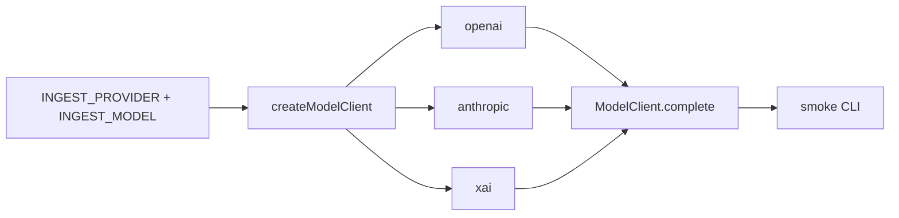

# ingest-classifier: first slice (model picker)

Per your answers: **TypeScript**, **modular**, **pick via environment variables**. The third provider is the **xAI API**, not `@cursor/sdk`. Cursor SDK stays out of this slice.

Work lives in `ingest-classifier/` and its own `memory-bank/`. `_collection` only gets a “agent added” note.

## Scope

**In**

- Copy `[_template/](_template/)` → `ingest-classifier/`
- TypeScript package with a `ModelClient` interface and three providers
- Env-based selection + a smoke CLI that sends one prompt
- Unit tests that do not call live APIs
- Agent bank updates (`DEC-001` runtime, `DEC-002` providers)

**Out**

- `classify_file` / `classify_records`
- LangGraph / orchestration graphs
- Cursor SDK agents




## Layout

```
ingest-classifier/
├── AGENTS.md, CLAUDE.md, memory-bank/
├── package.json
├── tsconfig.json
├── .env.example
├── src/
│   ├── index.ts              # public exports
│   ├── config.ts             # read/validate env
│   ├── providers/
│   │   ├── types.ts          # ModelClient
│   │   ├── openai.ts
│   │   ├── anthropic.ts
│   │   ├── xai.ts            # OpenAI SDK + baseURL https://api.x.ai/v1
│   │   └── createClient.ts   # factory
│   └── cli.ts                # pnpm start
└── src/providers/*.test.ts
```

`ModelClient` stays tiny so classification can sit on top later:

```ts
export type ModelClient = {
  provider: "openai" | "anthropic" | "xai";
  model: string;
  complete(prompt: string): Promise<string>;
};
```

## How picking works


| Env                 | Meaning                                                                          |
| ------------------- | -------------------------------------------------------------------------------- |
| `INGEST_PROVIDER`   | `openai`                                                                         |
| `INGEST_MODEL`      | Vendor model id (required), e.g. `gpt-4.1`, `claude-sonnet-4-20250514`, `grok-4` |
| `OPENAI_API_KEY`    | When provider is `openai`                                                        |
| `ANTHROPIC_API_KEY` | When provider is `anthropic`                                                     |
| `XAI_API_KEY`       | When provider is `xai`                                                           |


Unknown provider or missing key fails fast with a clear error. Document example values in `.env.example` (no secrets). Root `[.gitignore](.gitignore)` already ignores `.env`.

Defaults: none. Forcing an explicit pick is the point of this slice.

## Implementation notes

- Package manager: **pnpm**. Runner: **tsx**. Tests: **vitest** with mocked SDK clients.
- Dependencies: `openai`, `@anthropic-ai/sdk`. xAI reuses the OpenAI client (`baseURL: "https://api.x.ai/v1"`) so we do not add a fourth SDK.
- `pnpm start` reads env, constructs the client, sends a fixed one-line prompt (`Reply with the provider and model id.`), prints `{ provider, model, text }`.
- Tests cover: factory routing, missing key, unknown provider. No live network.

## Memory bank

1. Copy template; replace `AGENT_NAME` with `ingest-classifier`.
2. In **ingest-classifier** bank: `DEC-001` TypeScript modular package; `DEC-002` OpenAI / Anthropic / xAI via `INGEST_PROVIDER` + `INGEST_MODEL`.
3. Plan file: `ingest-classifier/memory-bank/plans/2026-09-02-model-picker.md`.
4. In **_collection** bank: mark `ingest-classifier` as started; do not put provider details there.

## Follow-up (not this plan)

Classification APIs (`classify_file`, `classify_records`) will call `ModelClient.complete` (or a later structured-output method) so swapping GPT / Claude / Grok stays a one-env-var change.