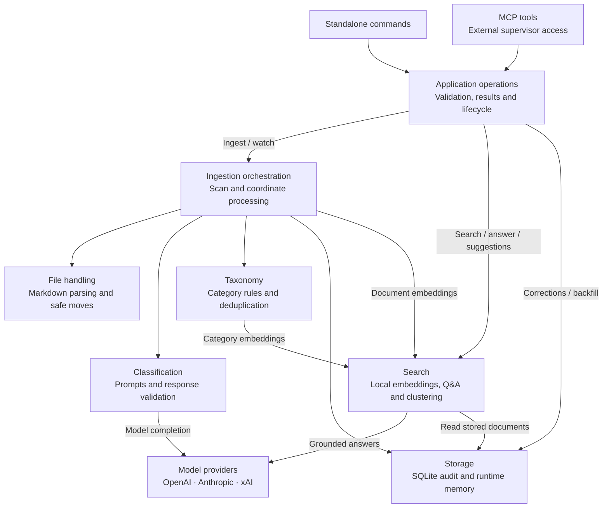

# ingest-classifier

TypeScript agent that watches a Markdown inbox, classifies notes, moves them without overwriting user data, and records every stage in SQLite. OpenAI GPT, Anthropic Claude, and xAI Grok remain env-only swaps.

## How it works

Each box represents a responsibility aligned with a source folder. Arrows show the main calls between concerns; they are not a step-by-step timeline or an exhaustive dependency graph. The table below maps these responsibilities to the code.



**How the folders work together:** the standalone CLI and `mcp/` adapter call shared `application/` operations. These validate inputs/results, own resource cleanup, and coordinate ingestion across processes. The application routes `run` and `watch` to `pipelines/`. The pipeline coordinates `files/` for parsing and safe moves, `classification/` for model decisions, `taxonomy/` for category resolution, `search/` for local embeddings, and `storage/` for persistence. Classification calls a `ModelClient` supplied by `providers/`, whose factory loads provider/model settings from `config.ts`.

`ask` and `cluster` call `search/` with document stores from `storage/`; answering also uses the selected model client. `correct` and `backfill` use `storage/`, with backfill reading files and computing local embeddings. `index.ts` exposes the public library API.

For each note, the model sees the current categories and the five most recent corrections. An existing-category fit above `0.80` reuses that category; otherwise the model proposes one. Local category embeddings check for a similar category before a new category and folder are created. Document embeddings are also computed locally; they do not require a separate embedding API.

During ingestion, audit records track processing as it happens. Markdown parse failures stay in the inbox and are audited as failures. Invalid classification responses are retried once; if still invalid, the note remains in the inbox and is audited as failed. Non-Markdown files are skipped. The mover verifies the destination checksum before removing the source. If saving document metadata fails after a move, the pipeline attempts to restore the source file. A document-embedding failure is recorded as missing and can be repaired with `backfill`.

For `ask`, only the question is newly embedded; stored document vectors select relevant excerpts for the model. Code attaches citations from those retrieved records. If no relevant sources are found, the command returns that result without requesting a model answer. `correct` saves feedback for later classification, and `cluster` writes suggestions for review; neither command reorganizes existing files automatically.

### The pieces

| Piece | Responsibility | Code |
|---|---|---|
| CLI and configuration | Select the command, library root, provider, and model | [`cli.ts`](src/cli.ts), [`config.ts`](src/config.ts) |
| Application operations | Share validated operations and lifecycle handling between CLI and MCP | [`application/`](src/application/) |
| MCP adapter | Discover and invoke six local tools for one configured library | [`mcp/`](src/mcp/) |
| Intake pipelines | Coordinate scanning, classification, safe movement, and persistence | [`pipelines/`](src/pipelines/) |
| Classifiers | Build prompts and validate model replies | [`classification/`](src/classification/) |
| Model providers | Create the selected model client and adapt vendor APIs | [`providers/`](src/providers/) |
| File handling | Parse Markdown and move the original bytes without overwriting files | [`files/`](src/files/) |
| Taxonomy | Define seed categories and resolve proposed categories through similarity checks | [`taxonomy/`](src/taxonomy/) |
| Runtime storage | Persist audit events, categories, document text/vectors, and human corrections in SQLite | [`storage/`](src/storage/) |
| Search and review | Compute local embeddings, retrieve sources, and suggest category splits | [`search/`](src/search/) |
| Offline evaluations | Exercise the M1–M3 workflows using fixture models, without live API calls | [`evals/`](evals/) |

`memory-bank/` records development progress and decisions for coding agents. The running classifier's memory lives in SQLite. Offline evaluations and development memory sit outside the runtime concerns shown above. `adaptivePipeline.ts` powers production `run` and `watch`; `pipeline.ts` is the fixed-taxonomy pipeline used by the M1 evaluation.

## Setup

Requires Node 22.22 or newer and pnpm 10.9.0 (pinned in `package.json`).

```bash
cd ingest-classifier
pnpm install
cp .env.example .env   # fill the key for the provider you pick
```

## Pick a model

| Env | Meaning |
|---|---|
| `INGEST_PROVIDER` | `openai` \| `anthropic` \| `xai` |
| `INGEST_MODEL` | Vendor model id |
| `OPENAI_API_KEY` | When provider is `openai` |
| `ANTHROPIC_API_KEY` | When provider is `anthropic` |
| `XAI_API_KEY` | When provider is `xai` |

```bash
pnpm start                         # provider smoke completion
pnpm run -- --root ./my-library    # adaptive classification, once
pnpm watch -- --root ./my-library  # adaptive classification, polling
pnpm eval:m1                       # offline 20-file zero-loss gate
pnpm eval:m2                       # offline 57-file adaptive-taxonomy gate
pnpm eval:m3                       # offline split-suggestion and grounded-Q&A gate
pnpm test
```

## Standalone and supervised use

The classifier works independently through its existing commands. A supervisor can invoke the same application operations through a local MCP server using the orchestrator–worker pattern. The supervisor owns planning and conversation; this agent owns classification, files, taxonomy, and SQLite. No supervisor is bundled.

Start one MCP server per library:

```bash
pnpm --silent mcp --root /absolute/path/to/my-library
# Optional explicit environment file:
pnpm --silent mcp --root /absolute/path/to/my-library --env-file /absolute/path/to/.env
```

Model settings are the same as the CLI. Inherited environment variables take precedence over the environment file; without `--env-file`, dotenv looks in the launch working directory. MCP loads it quietly. Startup and tool discovery do not need API keys; only ingestion and answering require a configured model. Local search, corrections, clustering, and backfill do not make completion calls.

Configure a local MCP host using absolute paths so it does not depend on its launch directory. Replace these placeholders with your Node 22 executable, agent checkout, library, and optional environment file:

```json
{
  "mcpServers": {
    "ingest-classifier": {
      "command": "/absolute/path/to/node",
      "args": [
        "--import",
        "/absolute/path/to/ingest-classifier/node_modules/tsx/dist/loader.mjs",
        "/absolute/path/to/ingest-classifier/src/mcp/main.ts",
        "--root",
        "/absolute/path/to/my-library",
        "--env-file",
        "/absolute/path/to/ingest-classifier/.env"
      ]
    }
  }
}
```

This direct Node launch avoids package-manager banners. MCP stdout contains protocol messages only; diagnostics go to stderr. The SDK negotiates modern and supported legacy MCP clients. This is a local stdio server, with no HTTP endpoint or remote authentication service.

### Available tools

| MCP tool | Input | Result and effects |
|---|---|---|
| `ingest_inbox` | `{}` | One batch, file outcomes and counts; moves files and updates taxonomy/storage |
| `search_documents` | `question`, optional `topK` and `minimumScore` | Paths, scores, summaries and snippets; no model completion |
| `ask_question` | Same as search | Grounded answer and citations using the configured model |
| `suggest_category_splits` | Optional `minimumCategorySize` | Suggestions only; no moves or report file |
| `record_correction` | `originalPath`, `wrongCategory`, `correctCategory`, optional `note` | Saved feedback; does not move files; repeated calls create separate records |
| `backfill_embeddings` | `{}` | Existing repair report with examined, created, repaired and failed counts |

Tools cannot change the configured root or credentials. Search defaults remain five results and a minimum score of `0.2`. `watch` and the model smoke command remain standalone commands.

Every tool advertises input/output schemas. Completed operations return the same envelope in `structuredContent` and a JSON text block. For example, calling `ingest_inbox` with `{}` on an empty inbox returns:

```json
{
  "status": "success",
  "data": {
    "results": [],
    "counts": { "total": 0, "succeeded": 0, "failed": 0, "skipped": 0 }
  },
  "error": null
}
```

`partial` means some work succeeded and some failed; `error` means all attempted work failed or the operation could not execute. Both set MCP `isError: true`; any available batch report is retained. Skipped files are separate from failures. Empty or entirely skipped batches succeed. Backfill reports similarly distinguish partial and complete failure. Inspect the report before retrying: successful files may already have moved.

Coded failures include `INVALID_INPUT`, `INVALID_OUTPUT`, `MODEL_CONFIGURATION`, `LIBRARY_BUSY`, `OPERATION_FAILED`, `INCOMPLETE`, and `APPLICATION_CLOSED`. The SDK may reject malformed tool arguments as an MCP validation error before the application runs. Invalid input must not start ingestion or mutate storage.

Existing CLI output remains command-specific JSON. In particular, `run` retains its array of individual results and its existing exit behavior for completed batches containing failed files; setup failures and busy libraries exit nonzero. The CLI still writes the clustering report to its selected output path.

### Ingestion ownership and shutdown

The CLI and MCP ingestion operations acquire an atomic `.ingest-classifier.lock/` directory in the canonical library root before opening the pipeline. Symlink aliases share the same lock. A second ingestion returns `LIBRARY_BUSY` immediately; requests are not queued. `watch` holds the lock until stopped. Internal document processing remains concurrent, and different libraries can ingest independently.

The lock protects ingestion only, not every SQLite operation. Search and other tools may be invoked while a watcher runs. Existing low-level pipeline exports are preserved, but direct callers must use `createIngestAgent` to obtain this cross-process coordination.

Normal completion and failures release the lock. Graceful shutdown stops accepting new work, stops watching, waits for active work, and then closes storage and the transport. Shutdown does not cancel an in-flight model call or undo a completed file move. These are bounded batch calls, not durable background jobs; a client timeout does not prove processing stopped.

After an abrupt termination, the lock may remain. Inspect its `owner.json` (PID, start time and canonical root), confirm **no ingestion process is still using that library**, then remove only the stale lock:

```bash
rm /absolute/path/to/my-library/.ingest-classifier.lock/owner.json
rmdir /absolute/path/to/my-library/.ingest-classifier.lock
```

Locks never expire based on age. Removing one while its owner is active defeats ingestion coordination. Crash recovery does not itself resume or roll back interrupted file processing.

### Native application interface

Other TypeScript callers can use the same operations without MCP. Imports do not load dotenv, open storage, start a server, or make model calls:

```typescript
import { createIngestAgent, createModelClient } from "./src/index.ts";

const agent = createIngestAgent({
  root: "/absolute/path/to/my-library",
  createModel: () => createModelClient(),
});
try {
  const result = await agent.ingestInbox();
  // Inspect result.status and result.data?.results before deciding the next step.
  console.log(result);
} finally {
  await agent.close();
}
```

Use an injected `model` and `embeddingProvider` for offline callers. `close()` is idempotent, rejects new work with `APPLICATION_CLOSED`, and waits for accepted work to finish.

### Offline MCP example and evaluation

```bash
pnpm eval:mcp
```

The [client example](evals/mcp.ts) starts a fixture server over real stdio in a temporary library. It discovers all six tools, ingests one valid and one invalid note, checks the partial result (`1` success / `1` failure), searches and answers with citations, records feedback, verifies suggestion-only clustering and backfill, and confirms a competing ingestion returns `LIBRARY_BUSY`. It removes its temporary library after completion and makes zero live model calls. This demonstrates worker integration without implementing a supervisor planning loop.

Verified on 2026-09-15 with Node 22.22.0 and pnpm 10.9.0: frozen installation, types, ESLint, Biome, 198 tests across 24 files, and all four offline evaluations (M1, M2, M3, MCP) pass. Verification also covered modern (2026-07-28) and legacy (2025-11-25) protocol negotiation, standalone CLI compatibility, clean protocol stdout, ingestion contention, and active-work draining on EOF/SIGTERM. Zero live model calls were used.

## Source layout

```text
src/
  index.ts          # public exports
  cli.ts            # command entry point
  config.ts         # environment configuration
  application/      # shared operations, contracts and ingestion lock
  mcp/              # local MCP tools, stdio lifecycle and entry point
  classification/   # fixed and adaptive classifiers
  pipelines/        # orchestration of intake and classification
  files/            # Markdown parsing and lossless file movement
  storage/          # SQLite audit, category, document, correction stores
  taxonomy/         # category definitions and proposal deduplication
  search/           # embeddings, clustering, grounded retrieval
  providers/        # model clients and provider contracts
evals/              # offline milestone runners and fixture clients
memory-bank/        # development memory for this agent
```

Tests live beside the modules they exercise. Import the library through `src/index.ts`; internal module paths may change as responsibilities evolve. CLI commands and library data formats remain stable across this folder reorganization.

## Development checks

| Command | Purpose |
|---|---|
| `pnpm typecheck` | TypeScript checks for source, tests, evaluations, and TypeScript tool configuration |
| `pnpm lint` | Recommended ESLint rules, with warnings treated as failures |
| `pnpm lint:fix` | Apply supported lint fixes |
| `pnpm format:check` | Check Biome formatting without writing files |
| `pnpm format` | Apply Biome formatting |
| `pnpm check` | Run type, lint, and formatting checks |

Use `pnpm install --frozen-lockfile` to reproduce the locked dependencies. ESLint handles code rules; Biome handles formatting with two spaces, double quotes, and semicolons. TypeScript 6.0.3 is pinned to match the ESLint TypeScript integration's supported compiler range.

GitHub Actions runs `pnpm check`, `pnpm test`, and `pnpm eval:m1`, `pnpm eval:m2`, `pnpm eval:m3`, and `pnpm eval:mcp` on pull requests and pushes to `main`. These checks use offline fixtures and need no model credentials. Generated dependencies, build output, coverage, and development memory are excluded from formatting/linting.

## Library contract

The `--root` folder is created when necessary and contains:

```text
<root>/
  inbox/
  library/
    project-specs/
    architecture-code/
    meeting-notes/
    personal-ideas/
    reference-material/
  ingest-classifier.sqlite
```

The stable category IDs and definitions live in `src/taxonomy/taxonomy.ts`. In the fixed-taxonomy M1 pipeline, files below 0.50 confidence are safely filed under `reference_material`; invalid model responses are retried, audited as failed, and left in the inbox. Destination collisions use `name-2.md`, `name-3.md`, and so on, and never overwrite an existing file.

Only `.md` files move. Other files remain in the inbox and receive a single `skipped` audit record. UTF-8 parse failures remain in place, receive a failed audit record, and do not stop the rest of a batch.

`pnpm eval:m1` creates an isolated temporary library with 20 valid, diverse Markdown notes plus invalid/ignored inputs. It succeeds only when all 20 valid notes move to seed folders and have complete audit rows; the printed temporary path can be inspected after the run.

## Adaptive taxonomy

The production `run` and `watch` commands load categories from SQLite on every classification. When the model reports an existing-category fit above 0.80, the note uses that category. Otherwise it proposes a name and one-sentence definition without moving the file yet.

Before creation, `local-hash-v1` embeds the proposal and compares it to stored category vectors. Similarity above `INGEST_CATEGORY_DEDUP_THRESHOLD` (default `0.85`) reuses the nearest category. A novel proposal is inserted in SQLite, its matching folder is created, and only then can the checksum-safe move occur.

`pnpm eval:m2` runs 57 notes offline in two waves. It verifies that novel equipment-maintenance and cooking themes create exactly one folder each, later related notes reuse them, an architecture paraphrase merges into the seed category, every note has a complete audit row, and no stored category pair crosses the duplicate threshold. The JSON report includes the human-review theme checklist.

## Document memory, corrections, and retrieval

Every adaptively sorted note stores its clean text, summary, destination path, and `local-hash-v1` embedding in SQLite. Embedding failures create an explicit `missing` document row so the gap is visible and repairable. Backfill M1/M2 audit records with:

```bash
pnpm backfill -- --root ./my-library
```

Record a durable correction (the five most recent corrections become few-shot prompt examples):

```bash
pnpm correct -- --root ./my-library --path ./library/architecture-code/retro.md \
  --wrong architecture_code --correct meeting_notes --note "Retrospective action items are meetings."
```

Generate suggestion-only clustering output. This reads stored vectors and writes a report; it never moves files:

```bash
pnpm cluster -- --root ./my-library
# writes ./my-library/cluster-suggestions.json
```

Ask a grounded question. The query alone is embedded; stored document vectors are reused. The answer includes only retrieved file citations and says so when nothing relevant is found:

```bash
pnpm ask -- --root ./my-library --question "What were the Q3 cache takeaways?"
```

`pnpm eval:m3` creates a mixed architecture library, proves a caching/authentication split suggestion without moving anything, records a correction, and answers a known caching question with citations to retrieved fixture files.
