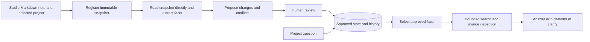

# Accuracy-first project manager

Implemented local-pilot architecture, updated 2026-10-05. The numerical acceptance gates remain provisional; offline fixture results measure controls, not LLM accuracy.

## Boundaries and execution

The manager owns projects, notes, candidate facts, approved state/history, review decisions, conversations, runs and evaluation reports in its SQLite database. The classifier owns immutable evidence snapshots, filing audits and project-scoped passage embeddings in a dedicated library. Studio calls each independent server through a typed tRPC client.

Intake and state updates are sequential. A per-project guard serializes intake, review and questions; review also checks the expected revision. Operations return persistent run IDs before asynchronous work starts. Startup marks interrupted runs/intakes as failed and retains the same source identity for retry. One manager process owns each database.

Extraction reads the entire submitted snapshot directly, independently of question-time retrieval. Questions allow one to six model turns, at most twelve tool calls, and a **total** budget of five raw retrieved passages. Search/read can address an evidence gap but cannot update approved state. The one-pass versus bounded comparison uses the same model, corpus, passage budget and three repetitions. Keeping extra turns requires improved holdout case success without decreased supported-claim precision.

## Five measurable modules

| Module | Implemented contract | Pilot gate |
|---|---|---|
| Registration | Project/source/version/key-bound immutable receipt; independent storage/index status; checksum validation | Correct project association; zero lost sources, false confirmations or duplicate retry results |
| Retrieval/read | Project SQL filter before ranking; snapshot chunks and offsets; read stable references; visible missing embedding count | Required evidence coverage ≥95% within five passages; zero project violations |
| Extraction | Entity, field/value, effective date and exact supporting passage; unknown values omitted | Supported precision ≥98%, required recall ≥90%, separately by field |
| Reconciliation | Pending proposals, conflicts, revision-checked review, append-only approval history | Change precision ≥98%, required recall ≥90%; zero stale reversions or duplicate updates |
| Answering | Approved fact IDs and citations, pending-review/coverage warnings and clarification | Supported precision ≥98%, completeness ≥90%, whole-case success ≥90% |

Observed fields are task description, owner, explicit due date, blocker and status/completion. Dates use ISO `YYYY-MM-DD`; status uses `open`, `in_progress`, `blocked`, `done`, or `cancelled`. `none` represents an explicitly resolved blocker. Suggestions are a separate answer output; the first version does not generate autonomous actions.

Exact quote validation verifies that a passage exists. It does **not** establish that the passage semantically supports the proposed value. Reference labels, human review and proposal precision/recall measure that distinction.

## Evidence contract

`evidence.ingest` accepts Markdown, selected project ID, source ID/version, idempotency key and optional source date. It commits immutable bytes before classification and returns the stable document reference/checksum with separate storage and indexing status. Retry cannot bind the same key or source version to different content or metadata. A stored snapshot remains readable even if classification or embeddings fail.

`evidence.search` applies the project predicate before ranking raw Markdown chunks using the existing embedding baseline. Legacy documents without a project association are excluded. `evidence.read` checks the selected project and snapshot checksum. Citation reads and embedding repair use immutable snapshots, including legacy backfill for associated documents, rather than editable taxonomy files. Missing indexes remain visible and can be retried.

The existing classifier commands and six MCP tools remain available. Run the project library's classifier server separately without its watcher, because the watcher owns the ingestion lock.

## Review and questions

Submission never changes approved state. Accepting a candidate appends its approved event; newer values replace the current field while older dated events stay historical. Different nonhistorical values remain pending conflicts until review. Disputed keys are excluded from definitive current answers; rejecting the conflicting proposal restores use of the last approved value.

Editing creates a human-confirmation evidence reference containing the correction. The review retains the original document-supported candidate and the correction separately. It never presents a reviewer correction as a quotation from the original note.

The model receives approved facts and prior questions for conversation context. Retrieval outputs are restricted to approved supporting passages; source reads supplied to the answer model contain approved passages only. Public citation navigation reads the complete immutable snapshot and verifies checksum and offsets. The answer model selects relevant approved fact IDs; code renders the corresponding field/value claims. Unapproved IDs fail the run. Pending-review and incomplete-index warnings persist with the answer.

## Evaluation and release boundary

The frozen corpus has 64 documents and 40 questions across eight synthetic projects, with five development and three held-out projects. Labels include project association, explicit facts, supporting spans, effective dates, review dispositions, state checkpoints and expected answers/clarification. Challenge cases cover similar names, changed deadlines, historical quotations, conflicting notes, resolved blockers, duplicate submissions and ingestion failures.

Score proposals before review; simulated review accepts correct candidates and rejects wrong ones without filling omissions. Isolate extraction with source snapshots, reconciliation with correct reference facts and answering with known approved state. Replay complete histories separately to expose upstream error propagation. Report denominators, field/split results, omissions, unnecessary clarification, errors/timeouts, first failing module, model/prompt/corpus settings and policy comparison. Empty predictions have undefined precision and fail required recall.

See [evaluation-data.md](evaluation-data.md) for corpus and manual live commands. The fixture parser/worker validate controls and scoring. Model benchmarks only shortlist later candidates; the initial baseline uses the configured Anthropic model without a hidden default. No representative real-world accuracy claim follows from synthetic control results.

This version uses the existing TypeScript/Node, tRPC, SQLite and Studio foundation. Connectors, scheduling, forecasting, automatic assignment and external actions are excluded.
