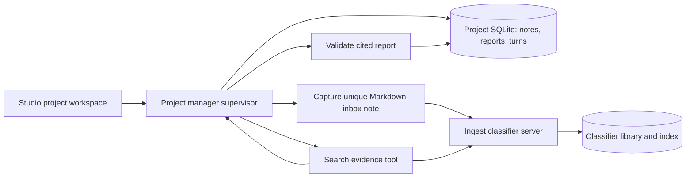

# Project manager architecture and stack

Decision recorded 2026-10-01. This is a local first version, with Studio notes as input and the existing classifier library as retrieval evidence. External connectors, scheduling, task assignment, and long-running autonomous execution are future scope.

## Structure: supervisor turns, sequential persistence

The manager owns project identity and the user conversation. The classifier is a worker invoked by the manager and returns an operation result; it does not take over the conversation. This preserves responsibility and makes failures understandable.

Writes use a fixed sequence: capture a note and persistent request ID → write uniquely named Markdown → request classifier ingestion → inspect the exact note result → mark stored. A partial batch can still store this note, so batch status alone does not determine success. Pending notes are excluded from model evidence. Retrying reuses a known worker run and checks existing inbox content before reuse.

Analysis uses up to six model turns. A turn can search for more evidence, receive results, and revise its answer; the final report tool validates its schema and source paths. Unknown evidence is recorded as questions. Successful user turns and reports persist and enter subsequent analysis as context. The latest 30 stored notes and six conversation turns bound initial context. The supervisor may retrieve older evidence from the library. Runs and tool/model traces persist; interrupted analysis becomes a visible failure at restart.

One mutation per project is allowed in a manager process. Run one manager process per database. Classifier locking governs library ingestion. The first version polls tRPC run records; it does not add a graph framework, queue, or second agent wire protocol. Model messages retain complete assistant blocks, including thinking blocks, during the current tool loop.

## Stack choice

| Layer | Initial choice | Reason |
| --- | --- | --- |
| Runtime | TypeScript, Node 22.22+, custom bounded loop | Fits both existing agents and Studio's typed router contract; only two supervisor tools are needed |
| Model | Anthropic SDK, configurable Sonnet 5.5, adaptive thinking at medium effort | Good knowledge-work performance/cost starting point; compatible with existing provider choice |
| Interface | Independent tRPC server on localhost:8788 | Studio never runs agent workflows in Next.js |
| Persistence | Own SQLite/WAL database | Durable local project state, notes, turns and runs; classifier remains document storage owner |
| UI | Existing Next.js/React/shadcn Studio | Dedicated projects workspace and shared trace viewer |
| Verification | Vitest with fake model and classifier, Biome, TypeScript | Reproducible behavior checks without model API spend |

Model benchmarks measure a model plus a harness; they do not establish that LangGraph, an SDK agent runner, or a custom loop is the best framework. The runtime choice follows this repository's boundaries and the small workflow. Adopt a durable workflow engine if multi-process execution, suspended human decisions, or scheduled jobs become requirements. Add PostgreSQL when multi-user access or concurrent server replicas are needed.

## Model selection evidence

[AA-Briefcase v1.1](https://artificialanalysis.ai/evaluations/aa-briefcase) evaluates 91 tasks across four knowledge-work scenarios, including product management, evidence use and conflicting source resolution. At the time of research, its leaderboard reports Opus 5.5 Max at 1822 Elo (±12) and Sonnet 5.5 Max at 1811 (±11). These intervals overlap. This is stronger task-fit evidence than a coding benchmark alone, and does not establish a statistically clear winner between these two entries.

[Anthropic's Sonnet 5.5 release](https://www.anthropic.com/claude-sonnet-5-5) reports GDPval-AA 1844 for Sonnet versus 1846 for Opus, and prices Sonnet at $2/$10 per million input/output tokens versus $4/$20 for Opus. The vendor says Opus remains stronger at complex open-ended judgment. These claims justify Sonnet as an initial cost-conscious default, with Opus as a candidate for harder conflict analysis rather than an automatic second model on every request. The AA values here were accessed directly on its benchmark page; GDPval comparisons come from Anthropic's report. Published Max-effort scores do not predict this implementation's medium-effort accuracy.

[Sonnet model documentation](https://platform.claude.com/docs/en/models/sonnet-5-5/overview) confirms model ID `claude-sonnet-5-5`. [Migration guidance](https://platform.claude.com/docs/en/models/sonnet-5-5/migration-guide) requires retaining full assistant content across tool turns and explains adaptive thinking defaults.

Before treating any model as the best for this project, evaluate it on sanitized project histories: field extraction, unsupported claims, cited evidence coverage, handling stale/conflicting dates, project mix-ups, missing-information questions, cost per valid report, and latency. Compare Sonnet and Opus at the actual configured effort. The current offline suite verifies orchestration behavior only. No live model benchmark was run.

## Practical limits

- The manager and classifier must share the configured filesystem library root. Identity is checked before capture and analysis. Intake triggers a batch of the whole classifier inbox, including other pending documents.
- The classifier's existing local hash-vector search remains unchanged. This is useful for initial integration, but needs a separate retrieval-quality evaluation before choosing a learned embedding provider.
- Library search is library-wide; project IDs are included in queries, but this is not an access-control boundary. Use separate libraries for separate trust domains. The model must judge whether retrieved evidence actually concerns this project.
- Citation validation checks that a path was supplied; it cannot prove that every claim is entailed by the text. Reports are proposals for user review.
- No distributed transaction spans capture, filesystem writes and classifier runs. If a worker response is lost after a successful move, a retry may need manual reconciliation with classifier audit history. Known run IDs survive timeouts. Recovery does not silently mark unconfirmed notes stored.
- Analysis is restart-detectable rather than resumable mid-model-turn. Intake is retryable from pending state. There is no scheduler or durable asynchronous queue.
